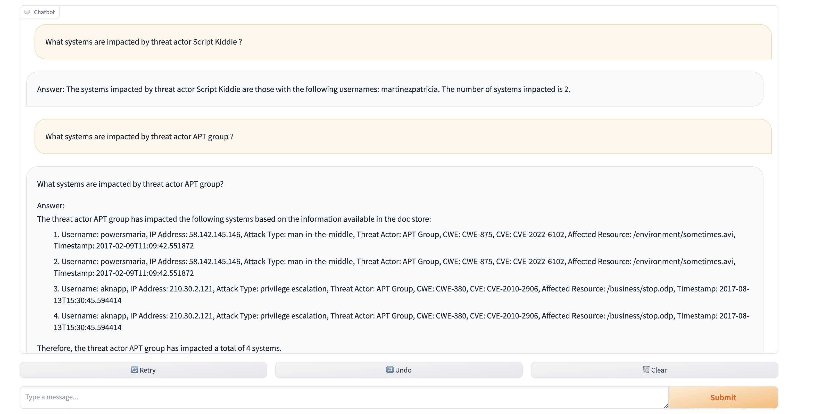

# Real time Threat Analysis Application using Apache Kafka, Qdrant VectorDB, Mistral 7B, Langchain and Gradio
This application is designed to process data in real-time using Apache Kafka, Mistral Large Language Model (LLM), and LangChain. The application consumes data from Kafka, processes it using Mistral LLM, and provides query-based responses using LangChain chains. Additionally, a user interface (UI) has been implemented using Gradio for easy interaction with the system.


## Features

- **Apache Kafka:** Real-time data generation and consumption.
- **Mistral LLM:** Integration with Mistral Large Language Model (LLM) for natural language processing tasks.
- **Chains**: Query-based response generation using LangChain chains.
- **Vector Database:** Utilizes HuggingFaceEmbeddings and Qdrant for creating a searchable vector database from the uploaded documents.
- **Interactive Chat:** User-friendly interface implemented with Gradio for easy interaction.


## Dataset information

We generate the fake cybersecurity data with following fields
- **username**: Username of the system
- **ip_address**: IP address of the system
- **user_agent**: User Agent is typically the web browser of the system
- **attack_types**: Different types of attacks that can happen over the system
- **threat_actors**: Threat actors are individuals, groups, or organizations that pose a threat to computer systems, networks, or data
- **cwe**: CWE stands for Common Weakness Enumeration. It is a community-developed list of software and hardware weakness types that can serve as a common language for describing software security vulnerabilities
- **cve**: CVE stands for Common Vulnerabilities and Exposures. Each CVE ID is associated with a description of the vulnerability, including details such as affected products, versions, and potential impact
- **affected_resource**: The file that gets affected negatively usually because of the attack
- **timestamp**: Time at which the attack happened
## Getting Started

### Requirements
- Python 3.10+
- Apache Kafka
- mistralai/Mistral-7B-Instruct-v0.2
- LangChain
- Gradio
- Nvidia GPU T4


## Installation
#### Setup Kafka
```
$ docker pull apache/kafka:3.7.0
$ sudo usermod -aG docker $USER
$ docker run -d -p 9092:9092 apache/kafka:3.7.0
```

#### Setup Qdrant DB
```
mkdir -p /home/jupyter/qdrant
docker pull qdrant/qdrant
docker run -d -p 6333:6333 -p 6334:6334 -v /home/jupyter/qdrant:/qdrant/storage qdrant/qdrant
```

#### Clone the repository and install the required dependencies:

```
git clone https://github.com//hkhajgiwale/real-time-threat-analysis-kafka-mistral7b-qdrant-gradio.git
cd real-time-threat-analysis-kafka-mistral7b-qdrant-gradio
pip install -r requirements.txt
```
#### Generating the cybersecurity data for threat analysis
Run the python file to generate the fake data and push it to Kafka in the infinite loop. Only once you interrupt it, only then the script will terminate
```
python3.10 generate_events.py
```
####  Running the application
To run the app, navigate to the project directory and execute:
```
python3.10 app.py
```


## Usage
Once the application is running, navigate to the provided URL in your web browser and hit your questions. The LLM will process the output and reply accordingly



## Jupyter Notebook


This Jupyter Notebook contains cells that can be executed to demonstrate the real-time data processing pipeline using Apache Kafka, a vector store for document storage, and a Large Language Model (LLM) for generating answers to queries.

****Step by Step Execution Instructions****

1. **Kafka Consumer Setup**: Run the cell to set up a Kafka consumer that will consume data from a Kafka topic.

2. **Document Creation**: Execute the cell to create documents from the consumed data and store them in a vector store for indexing.

3. **LLM Loading**: Load the Large Language Model (LLM) for processing the queries.

4. **Query Generation**: Generate queries and use the LLM to generate answers based on the stored documents.

5. **User Interaction**: Optionally, interact with the system to input queries and observe the responses generated by the LLM.

**Note**: Ensure that the necessary dependencies, such as Kafka, the vector store, and the LLM, are properly set up and configured before executing the cells.


## Acknowledgements

 - [HuggingFace](https://huggingface.co/) For out of the world LLMs and `transformer` package
 - [Mistral AI](https://mistral.ai/) for high performance, solidly trained LLM
 - [Qdrant](https://qdrant.tech/) for high-performant vector similarity search technology.
 - [Gradio](https://www.gradio.app/) for seamless app development framework
 - [Superteams](https://www.superteams.ai/) for providing GPUs with GCP


## Contributing
We wholeheartedly welcome contributions to improvise the app and/or extend its capabilities. Please feel free to fork the repository, ammend your changes, and submit a pull request.


